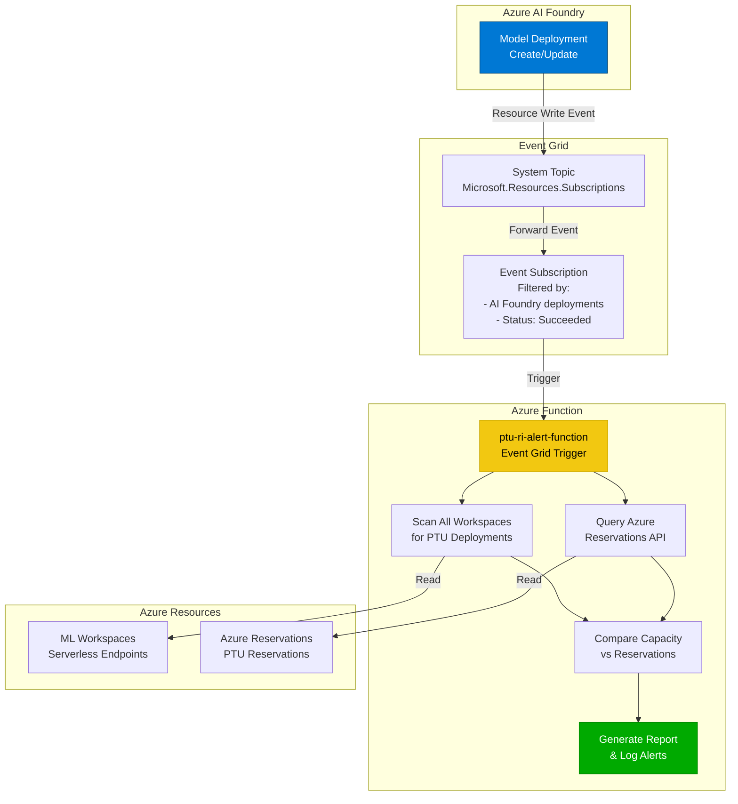

# PTU RI Alert

Azure Function to monitor and alert on Azure AI Foundry PTU (Provisioned Throughput Units) deployments and track capacity vs reservations.

## Overview

This solution automatically monitors Azure AI Foundry model deployments and compares total PTU capacity against Azure Reservations to detect over-allocation or under-utilization.

### Example Output

```
================================================================================
📊 PTU CAPACITY vs RESERVATIONS REPORT
================================================================================
Total PTU Deployments: 3
Total PTU Capacity Allocated: 150
Total PTU Reservations: 200
Reservation Utilization: 75.0%

✅ Under-utilized: 50 PTUs available

Deployment Details:
  - project-1/gpt-4-deployment: 100 PTUs (gpt-4)
  - project-2/gpt-35-turbo: 30 PTUs (gpt-35-turbo)
  - project-3/gpt-4-turbo: 20 PTUs (gpt-4-turbo)

Reservation Details:
  - OpenAI PTU Reservation: 200 units
================================================================================
```

## Architecture



## Prerequisites

- Azure CLI installed and authenticated
- Azure Functions Core Tools v4
- Python 3.11+
- Azure subscription with:
  - Azure AI Foundry project(s)
  - Azure Function App (Flex Consumption or Consumption plan)
  - Permissions to create Event Grid topics and subscriptions
  - Reader access to ML workspaces and reservations

## Setup and Testing Guide

### Step 1: Create the Azure Function App

First, create the Function App in Azure (if not already created):

```bash
# Set variables
SUBSCRIPTION_ID="your-subscription-id"
RESOURCE_GROUP="your-resource-group"
LOCATION="eastus2"
FUNCTION_APP_NAME="ptu-ri-alert"
STORAGE_ACCOUNT="yourptualertstorage"

# Create storage account (if needed)
az storage account create \
  --name $STORAGE_ACCOUNT \
  --resource-group $RESOURCE_GROUP \
  --location $LOCATION \
  --sku Standard_LRS

# Create Function App (Flex Consumption)
az functionapp create \
  --name $FUNCTION_APP_NAME \
  --resource-group $RESOURCE_GROUP \
  --storage-account $STORAGE_ACCOUNT \
  --runtime python \
  --runtime-version 3.11 \
  --functions-version 4 \
  --os-type Linux
```

#### Verify Function App Creation

```bash
# Check if function app exists and is running
az functionapp show \
  --name $FUNCTION_APP_NAME \
  --resource-group $RESOURCE_GROUP \
  --query "{Name:name, State:state, Location:location}" \
  --output table
```

You should see the function app with `State: Running`.

### Step 2: Configure Function App Settings

Set the required app settings for Python V2 programming model:

```bash
# Enable worker indexing (required for Python V2 model)
az functionapp config appsettings set \
  --name $FUNCTION_APP_NAME \
  --resource-group $RESOURCE_GROUP \
  --settings AzureWebJobsFeatureFlags=EnableWorkerIndexing
```

**Note**: For Flex Consumption plans, do NOT set `FUNCTIONS_WORKER_RUNTIME` as it's managed automatically.

#### Verify Configuration

```bash
# Check app settings
az functionapp config appsettings list \
  --name $FUNCTION_APP_NAME \
  --resource-group $RESOURCE_GROUP \
  --query "[?name=='AzureWebJobsFeatureFlags'].{Name:name, Value:value}" \
  --output table
```

You should see `AzureWebJobsFeatureFlags` set to `EnableWorkerIndexing`.

### Step 3: Enable Managed Identity, Assign Permissions, and Configure Event Grid

**Critical**: The function requires a managed identity with proper permissions to access Azure resources.

Run the automated setup script that handles everything:

```bash
cd event-grid
chmod +x setup-event-grid.sh
./setup-event-grid.sh
```

This script will:
1. Enable system-assigned managed identity on the function
2. Assign the Reader role at subscription level (provides access to read CognitiveServices/AI Foundry deployments and Azure Reservations)
3. Create the Event Grid system topic
4. Create the event subscription with proper filters

**Note**: The script reads configuration from the `.env` file you created earlier.

#### Verify Managed Identity and Permissions

```bash
# Verify managed identity is enabled
az functionapp identity show \
  --name $FUNCTION_APP_NAME \
  --resource-group $RESOURCE_GROUP \
  --query "{PrincipalId:principalId, Type:type}" \
  --output table

# Get the principal ID and check role assignments
PRINCIPAL_ID=$(az functionapp identity show \
  --name $FUNCTION_APP_NAME \
  --resource-group $RESOURCE_GROUP \
  --query principalId -o tsv)

echo "Principal ID: $PRINCIPAL_ID"
echo ""
echo "Role Assignments:"
az role assignment list \
  --assignee $PRINCIPAL_ID \
  --query "[].{Role:roleDefinitionName, Scope:scope}" \
  --output table
```

Expected output should show:
```
Role      Scope
--------  -----------------------------------------------------
Reader    /subscriptions/12345678-1234-1234-1234-123456789abc
```

### Step 4: Deploy the Function

Install dependencies and deploy the function:

```bash
cd function-app

# Deploy to Azure
func azure functionapp publish $FUNCTION_APP_NAME
```

Verify the function was deployed successfully:

```bash
az functionapp function list \
  --name $FUNCTION_APP_NAME \
  --resource-group $RESOURCE_GROUP \
  --query "[].{Name:name, TriggerType:config.bindings[0].type}" \
  --output table
```

You should see:
```
Name                      TriggerType
------------------------  ---------------
ptu-ri-alert-function     eventGridTrigger
```

### Step 5: Verify Event Grid Setup

The Event Grid system topic and subscription were created by the script in Step 3. Let's verify everything is configured correctly:

#### Verify Event Grid Setup

```bash
# Verify system topic was created
az eventgrid system-topic show \
  --name AIFoundryDeploymentTopic \
  --resource-group $RESOURCE_GROUP \
  --query "{Name:name, ProvisioningState:provisioningState, TopicType:topicType}" \
  --output table

# Verify event subscription was created
az eventgrid system-topic event-subscription show \
  --name NewAIFoundryDeploymentSubscription \
  --resource-group $RESOURCE_GROUP \
  --system-topic-name AIFoundryDeploymentTopic \
  --query "{Name:name, ProvisioningState:provisioningState, Endpoint:destination.endpointType}" \
  --output table
```

### Step 6: Test with a Deployment

Create a test deployment to verify the monitoring function works:

```bash
# For PTU-based deployment (will show in capacity report):
az cognitiveservices account deployment create \
  --resource-group $RESOURCE_GROUP \
  --name your-ai-foundry-resource \
  --deployment-name test-ptu-gpt4 \
  --model-name gpt-4 \
  --model-version "0125-Preview" \
  --model-format OpenAI \
  --sku-capacity 100 \
  --sku-name "ProvisionedManaged"
```

**Note:** Only deployments with SKU names starting with **"Provisioned"** (e.g., `ProvisionedManaged`) use PTUs. Other SKUs like `Standard`, `GlobalStandard` are pay-as-you-go (PAYG) and use tokens-per-minute (TPM).

#### Verify Event Grid Captured the Event

Wait ~30-60 seconds after deployment, then check Event Grid metrics:

```bash
# Check if event was matched
az monitor metrics list \
  --resource "/subscriptions/$SUBSCRIPTION_ID/resourceGroups/$RESOURCE_GROUP/providers/Microsoft.EventGrid/systemTopics/AIFoundryDeploymentTopic" \
  --metric "MatchedEventCount" \
  --start-time $(date -u -d '5 minutes ago' +%Y-%m-%dT%H:%M:%SZ) \
  --interval PT1M \
  --output table | grep -v "0.0"
```

**Expected output:**
```
Timestamp             Name            Total
--------------------  --------------  -------
2025-10-28T00:31:00Z  Matched Events  1.0
```

#### Verify Event Was Delivered to Function

```bash
# Check delivery status
az monitor metrics list \
  --resource "/subscriptions/$SUBSCRIPTION_ID/resourceGroups/$RESOURCE_GROUP/providers/Microsoft.EventGrid/systemTopics/AIFoundryDeploymentTopic" \
  --metric "DeliverySuccessCount" \
  --start-time $(date -u -d '5 minutes ago' +%Y-%m-%dT%H:%M:%SZ) \
  --interval PT1M \
  --output table | grep -v "0.0"
```

**Expected output:**
```
Timestamp             Name                        Total
--------------------  --------------------------  -------
2025-10-28T00:31:00Z  Delivery Succeeded Events   1.0
```

#### Verify Function Executed

```bash
# Check function execution count
az monitor metrics list \
  --resource "/subscriptions/$SUBSCRIPTION_ID/resourceGroups/$RESOURCE_GROUP/providers/Microsoft.Web/sites/$FUNCTION_APP_NAME" \
  --metric "OnDemandFunctionExecutionCount" \
  --start-time $(date -u -d '10 minutes ago' +%Y-%m-%dT%H:%M:%SZ) \
  --interval PT1M \
  --output table | grep -v "0.0"
```

**Expected output:**
```
Timestamp             Name                                Total
--------------------  ----------------------------------  -------
2025-10-28T00:31:00Z  On Demand Function Execution Count  1.0
```

#### View Function Logs and PTU Report

Go to Azure Portal to see the detailed PTU capacity report:

1. Navigate to: **Function App** → **ptu-ri-alert** → **Functions** → **ptu-ri-alert-function** → **Monitor**
2. Click on the most recent invocation (timestamp should match your deployment time)
3. View the logs

**Expected log output:**
```
================================================================================
🚨 NEW AI FOUNDRY DEPLOYMENT EVENT
================================================================================
Deployment: test-ptu-gpt4
Account: your-ai-foundry-resource
Resource Group: your-rg

================================================================================
📊 PTU CAPACITY CHECK
================================================================================
🔍 Scanning deployments in account: your-ai-foundry-resource

Found deployment: test-ptu-gpt4
  Model: gpt-4
  SKU: ProvisionedManaged
  Capacity: 100 PTUs

📈 Total deployed PTUs in this account: 100

🔍 Checking PTU reservations in subscription...
💰 Total reserved PTUs in subscription: 0

================================================================================
📊 CAPACITY vs RESERVATIONS REPORT
================================================================================
⚠️  NO RESERVATIONS FOUND!
   All 100 deployed PTUs will be billed hourly
   Consider purchasing reservations for cost savings
```

## How It Works

1. **Deployment Event**: When you create/update an AI Foundry model deployment, Azure emits a resource event
2. **Event Grid Filtering**: The system topic captures subscription-level events and filters for:
   - `Microsoft.CognitiveServices/accounts/deployments/write` (AI Foundry/OpenAI deployments)
   - Status: `Succeeded`
3. **Function Trigger**: The Azure Function receives the filtered event
4. **PTU Scanning**: Function uses managed identity to:
   - Read all deployments in the CognitiveServices account
   - Identify deployments with PTU capacity (SkuName starts with "Provisioned")
   - Sum total deployed PTUs
5. **Reservation Check**: Query Azure Reservations API for PTU reservations
6. **Report**: Log comparison results showing:
   - Total deployed PTUs across all models
   - Total reserved PTUs
   - Coverage status (fully covered / exceeds capacity / no reservations)

## Monitoring and Logs

### Viewing Logs in Azure Portal

1. Navigate to your Function App in Azure Portal
2. Go to **Functions** → **ptu-ri-alert-function** → **Monitor**
3. Click on any recent invocation to see detailed logs
4. Look for the PTU capacity report in the logs

### Application Insights Query

If Application Insights is enabled:

```kusto
traces
| where timestamp > ago(1h)
| where message contains "PTU" or message contains "deployment"
| order by timestamp desc
| project timestamp, message, severityLevel
```

### CLI Metrics

Check function execution metrics:

```bash
# Check if function was triggered
az monitor metrics list \
  --resource "/subscriptions/$SUBSCRIPTION_ID/resourceGroups/$RESOURCE_GROUP/providers/Microsoft.Web/sites/$FUNCTION_APP_NAME" \
  --metric "OnDemandFunctionExecutionCount" \
  --start-time $(date -u -d '1 hour ago' +%Y-%m-%dT%H:%M:%SZ) \
  --interval PT1M \
  --output table

# Check Event Grid delivery metrics
az monitor metrics list \
  --resource "/subscriptions/$SUBSCRIPTION_ID/resourceGroups/$RESOURCE_GROUP/providers/Microsoft.EventGrid/systemTopics/AIFoundryDeploymentTopic" \
  --metric "MatchedEventCount,DeliverySuccessCount" \
  --start-time $(date -u -d '1 hour ago' +%Y-%m-%dT%H:%M:%SZ) \
  --interval PT1M \
  --output table
```

### Local Testing (Optional)

If you want to test the function locally before deploying:

```bash
cd function-app
func start
```

In another terminal, send a test Event Grid event:

```bash
curl -X POST http://localhost:7071/runtime/webhooks/EventGrid?functionName=ptu-ri-alert-function \
  -H "Content-Type: application/json" \
  -H "aeg-event-type: Notification" \
  -d '[
    {
      "id": "test-id",
      "eventType": "Microsoft.Resources.ResourceWriteSuccess",
      "subject": "/subscriptions/YOUR_SUB_ID/resourceGroups/YOUR_RG/providers/Microsoft.CognitiveServices/accounts/YOUR_ACCOUNT/deployments/test-deployment",
      "eventTime": "2025-10-27T12:00:00Z",
      "data": {
        "operationName": "Microsoft.CognitiveServices/accounts/deployments/write",
        "status": "Succeeded"
      },
      "dataVersion": "1.0",
      "metadataVersion": "1",
      "topic": "/subscriptions/YOUR_SUB_ID"
    }
  ]'
```

## Troubleshooting

### Authentication Errors

If you see `DefaultAzureCredential failed to retrieve a token`:

1. **Verify managed identity is enabled**:
   ```bash
   az functionapp identity show --name $FUNCTION_APP_NAME --resource-group $RESOURCE_GROUP
   ```

2. **Verify role assignments**:
   ```bash
   PRINCIPAL_ID=$(az functionapp identity show --name $FUNCTION_APP_NAME --resource-group $RESOURCE_GROUP --query principalId -o tsv)
   az role assignment list --assignee $PRINCIPAL_ID --output table
   ```
   
   You should see the "Reader" role at subscription level.

3. **Wait for permissions to propagate**: It can take 15-30 seconds for role assignments to take effect. Redeploy if needed:
   ```bash
   cd function-app
   func azure functionapp publish $FUNCTION_APP_NAME
   ```

### Event Not Captured

If deployments don't trigger the function:

1. **Check Event Grid metrics**:
   ```bash
   az monitor metrics list \
     --resource "/subscriptions/$SUBSCRIPTION_ID/resourceGroups/$RESOURCE_GROUP/providers/Microsoft.EventGrid/systemTopics/AIFoundryDeploymentTopic" \
     --metric "MatchedEventCount,DeliverySuccessCount,DeliveryAttemptFailCount" \
     --start-time $(date -u -d '1 hour ago' +%Y-%m-%dT%H:%M:%SZ) \
     --interval PT5M \
     --output table
   ```

2. **Verify event subscription filters**:
   ```bash
   az eventgrid system-topic event-subscription show \
     --name NewAIFoundryDeploymentSubscription \
     --resource-group $RESOURCE_GROUP \
     --system-topic-name AIFoundryDeploymentTopic \
     --query "{SubjectBeginsWith:filter.subjectBeginsWith, AdvancedFilters:filter.advancedFilters}"
   ```

3. **Check function execution count**:
   ```bash
   az monitor metrics list \
     --resource "/subscriptions/$SUBSCRIPTION_ID/resourceGroups/$RESOURCE_GROUP/providers/Microsoft.Web/sites/$FUNCTION_APP_NAME" \
     --metric "OnDemandFunctionExecutionCount" \
     --start-time $(date -u -d '1 hour ago' +%Y-%m-%dT%H:%M:%SZ) \
     --interval PT5M \
     --output table
   ```

### Function Execution Failures

Check the function logs in Azure Portal → Function App → Functions → ptu-ri-alert-function → Monitor

Common issues:
- Missing managed identity (see Authentication Errors above)
- Invalid CognitiveServices account name in the event
- Network connectivity issues

### Function not appearing after deployment

1. Verify the file is named `function_app.py` (not `__init__.py`)
2. Check that `AzureWebJobsFeatureFlags=EnableWorkerIndexing` is set
3. Restart the function app: `az functionapp restart --name $FUNCTION_APP_NAME --resource-group $RESOURCE_GROUP`
4. Redeploy: `func azure functionapp publish $FUNCTION_APP_NAME`

### Event Grid subscription creation fails

1. Ensure the function is deployed and visible
2. Verify the function name matches exactly: `ptu-ri-alert-function`
3. Check that the AI project name is correct
4. Run the setup script again after fixing configuration

### Function receives events but can't check PTU capacity

1. Verify managed identity is enabled on the function app
2. Check that Reader role is assigned at subscription level
3. Verify Reservation Reader role if checking reservations
4. Check function logs for detailed error messages

## Architecture Details

## Project Structure

```
ptu-ri-alert/
├── README.md
├── pyproject.toml
├── function-app/
│   ├── function_app.py          # Main function code (Python V2 model)
│   ├── requirements.txt          # Python dependencies
│   ├── host.json                # Function host configuration
│   ├── local.settings.json      # Local development settings
│   └── .funcignore              # Files to exclude from deployment
└── event-grid/
    └── setup-event-grid.sh      # Event Grid setup script
```

## Important Notes

- **File Naming**: The function code must be in `function_app.py` (not `__init__.py`) for Python V2 programming model
- **Deployment Order**: Deploy the function BEFORE creating the Event Grid subscription
- **Flex Consumption**: If using Flex Consumption plan, do not manually set `FUNCTIONS_WORKER_RUNTIME`
- **Worker Indexing**: `AzureWebJobsFeatureFlags=EnableWorkerIndexing` is required for Python V2 model
- **Permissions**: The function's managed identity needs Reader access to workspaces and reservations

## Permissions Reference

### Required Permissions for Full Functionality

The function requires different permissions depending on what resources it needs to access:

#### 1. Reading CognitiveServices Deployments ✅ (Required)

**Role:** Reader  
**Scope:** Subscription level  
**Purpose:** Read AI Foundry/CognitiveServices account deployments to scan PTU capacity

```bash
PRINCIPAL_ID=$(az functionapp identity show \
  --name $FUNCTION_APP_NAME \
  --resource-group $RESOURCE_GROUP \
  --query principalId -o tsv)

az role assignment create \
  --assignee $PRINCIPAL_ID \
  --role "Reader" \
  --scope "/subscriptions/$SUBSCRIPTION_ID"
```

**Permissions granted:**
- `Microsoft.CognitiveServices/accounts/read`
- `Microsoft.CognitiveServices/accounts/deployments/read`

**What happens without this:**
```
❌ Error: DefaultAzureCredential failed to retrieve a token
   or
❌ Error: (AuthorizationFailed) does not have authorization to perform action 
   'Microsoft.CognitiveServices/accounts/deployments/read'
```

#### 2. Reading Azure Reservations 📊 (Optional, for reservation tracking)

**Role:** Reservations Reader  
**Scope:** Tenant level (`/providers/Microsoft.Capacity`)  
**Purpose:** Query PTU reservations to compare against deployed capacity

```bash
# Requires tenant-level admin permissions
az role assignment create \
  --assignee $PRINCIPAL_ID \
  --role "Reservations Reader" \
  --scope "/providers/Microsoft.Capacity"
```

**Permissions granted:**
- `Microsoft.Capacity/reservationOrders/read`
- `Microsoft.Capacity/reservations/read`

**What happens without this:**
```
⚠️  Could not query reservations: (AuthorizationFailed) 
    The client does not have authorization to perform action 
    'Microsoft.Capacity/reservationOrders/read' over scope '/providers/Microsoft.Capacity'
💰 Total reserved PTUs in subscription: 0
```

**Note:** The function will still work without this permission, but it won't be able to compare deployed PTUs against your reservations. It will simply report the total deployed PTUs.

#### 3. Permission Propagation Time

After assigning roles, permissions can take **15-30 seconds** to propagate. If you see authentication errors immediately after role assignment:

1. Wait 30 seconds
2. Redeploy the function or trigger a new deployment event
3. Check the function logs again

### Verification Commands

Check current role assignments:
```bash
PRINCIPAL_ID=$(az functionapp identity show \
  --name $FUNCTION_APP_NAME \
  --resource-group $RESOURCE_GROUP \
  --query principalId -o tsv)

echo "Principal ID: $PRINCIPAL_ID"
echo ""
echo "Role Assignments:"
az role assignment list \
  --assignee $PRINCIPAL_ID \
  --query "[].{Role:roleDefinitionName, Scope:scope}" \
  --output table
```

Expected output:
```
Role                  Scope
--------------------  -----------------------------------------------------
Reader                /subscriptions/12345678-1234-1234-1234-123456789abc
Reservations Reader   /providers/Microsoft.Capacity
```